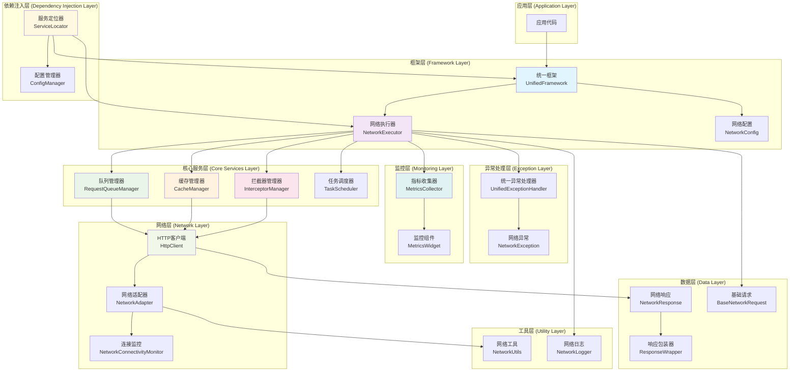
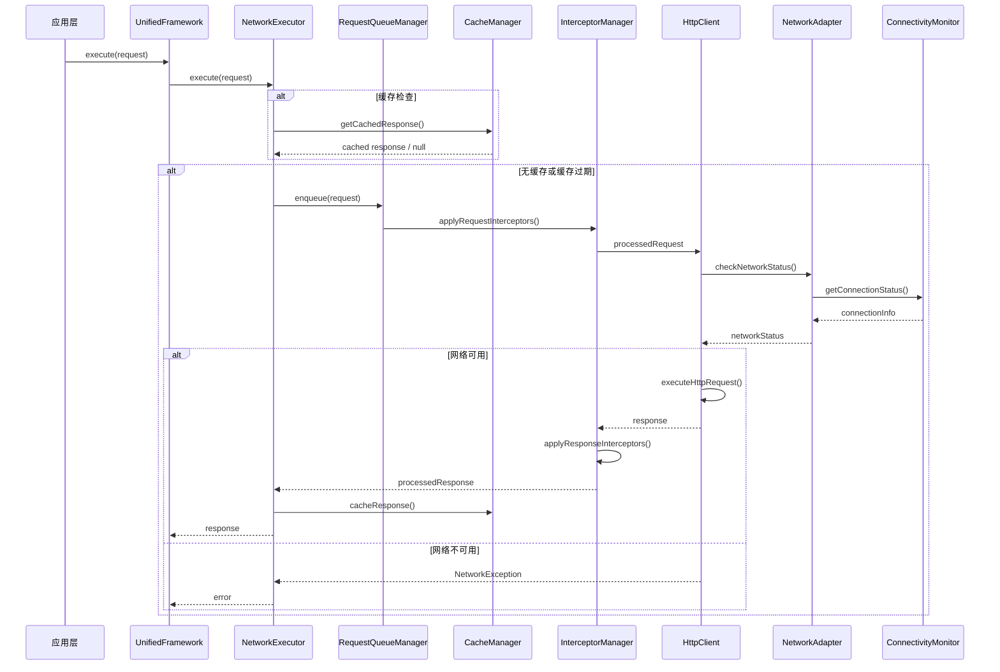
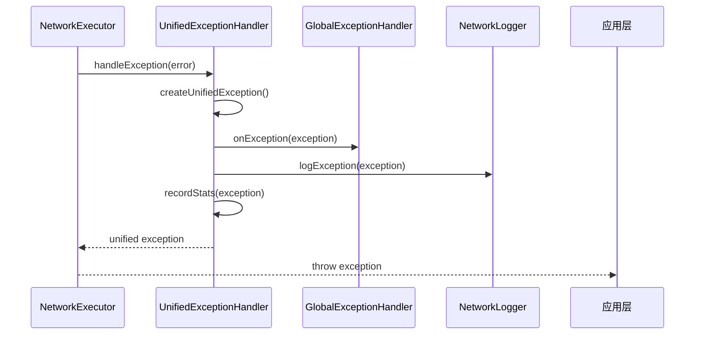

# BZY 网络框架总纲文档

## 框架概述

BZY Network Framework 是一个功能完整、高性能的 Flutter 网络请求框架，基于 Dio 构建，提供了统一的网络请求管理、智能缓存、队列调度、异常处理、网络适配等核心功能。框架采用插件化架构设计，支持高度定制和扩展。

### 版本信息
- **框架名称**: BZY Network Framework
- **当前版本**: 1.0.6
- **基础依赖**: Dio, Logging, Connectivity Plus, Synchronized

## 核心设计理念

### 1. 统一性 (Unified)
- 统一的网络请求入口
- 统一的异常处理机制
- 统一的配置管理系统
- 统一的日志记录规范

### 2. 插件化 (Pluggable)
- 可插拔的功能模块
- 灵活的拦截器系统
- 可扩展的适配器架构
- 模块化的组件设计

### 3. 高性能 (High Performance)
- 智能的请求队列管理
- 高效的缓存机制
- 并发控制和优化
- 内存使用优化

### 4. 可靠性 (Reliability)
- 完善的异常处理
- 自动重试机制
- 网络状态适配
- 弱网环境优化

## 架构概览

BZY Network Framework 采用分层架构设计，各层职责清晰，模块间松耦合：



## 模块架构详解

### 1. 核心层 (Core Layer)

#### 1.1 统一框架 (UnifiedFramework)
- **位置**: `lib/src/frameworks/unified_framework.dart`
- **职责**: 框架的核心入口点，管理插件生命周期
- **特性**: 单例模式、插件化架构、全局拦截器管理

#### 1.2 网络执行器 (NetworkExecutor)
- **位置**: `lib/src/requests/network_executor.dart`
- **职责**: 统一的网络请求执行引擎
- **特性**: 并发控制、请求去重、生命周期跟踪、缓存集成

#### 1.3 配置管理 (NetworkConfig)
- **位置**: `lib/src/config/network_config.dart`
- **职责**: 网络配置的统一管理
- **特性**: 预设配置、动态配置、环境适配

### 2. 队列管理层 (Queue Management Layer)

#### 2.1 请求队列管理器 (RequestQueueManager)
- **位置**: `lib/src/core/queue/request_queue_manager.dart`
- **职责**: 网络请求的队列调度和管理
- **特性**: 多优先级队列、并发控制、请求去重、超时监控

### 3. 缓存管理层 (Cache Management Layer)

#### 3.1 缓存管理器 (CacheManager)
- **位置**: `lib/src/core/cache/cache_manager.dart`
- **职责**: 高性能的缓存管理系统
- **特性**: 双层缓存、智能策略、标签系统、数据压缩

### 4. 拦截器层 (Interceptor Layer)

#### 4.1 拦截器管理器 (InterceptorManager)
- **位置**: `lib/src/core/interceptor/interceptor_manager.dart`
- **职责**: 插件化的拦截器管理系统
- **特性**: 动态注册、优先级控制、配置管理、性能监控

### 5. 网络适配层 (Network Adaptation Layer)

#### 5.1 网络适配器 (NetworkAdapter)
- **位置**: `lib/src/core/network/network_adapter.dart`
- **职责**: 智能网络适配和优化
- **特性**: 网络状态监控、质量检测、自适应策略、弱网优化

#### 5.2 网络连接监控 (NetworkConnectivityMonitor)
- **位置**: `lib/src/core/network/network_connectivity_monitor.dart`
- **职责**: 网络连接状态的实时监控
- **特性**: 状态变化监听、连接质量检测、事件通知

### 6. 异常处理层 (Exception Handling Layer)

#### 6.1 统一异常处理器 (UnifiedExceptionHandler)
- **位置**: `lib/src/core/exception/unified_exception_handler.dart`
- **职责**: 统一的异常处理和管理
- **特性**: 异常分类、错误码标准化、全局处理器、统计监控

#### 6.2 网络异常 (NetworkException)
- **位置**: `lib/src/core/exception/network_exception.dart`
- **职责**: 网络相关异常的定义和处理
- **特性**: 标准化异常格式、详细错误信息、可扩展性

### 7. 调度管理层 (Scheduling Layer)

#### 7.1 任务调度器 (TaskScheduler)
- **位置**: `lib/src/core/scheduler/task_scheduler.dart`
- **职责**: 任务调度和执行管理
- **特性**: 定时任务、优先级调度、资源管理

### 8. 配置管理层 (Configuration Layer)

#### 8.1 配置管理器 (ConfigManager)
- **位置**: `lib/src/core/config/config_manager.dart`
- **职责**: 高级配置管理和动态配置
- **特性**: 热配置更新、环境配置、配置验证

#### 8.2 服务定位器 (ServiceLocator)
- **位置**: `lib/src/core/di/service_locator.dart`
- **职责**: 依赖注入和服务管理
- **特性**: 单例管理、依赖解析、生命周期管理

### 9. 指标监控层 (Metrics Layer)

#### 9.1 指标收集器 (MetricsCollector)
- **位置**: `lib/src/metrics/metrics_collector.dart`
- **职责**: 性能指标收集和统计
- **特性**: 实时监控、数据统计、性能分析

#### 9.2 监控组件 (NetworkMetricsWidget)
- **位置**: `lib/src/metrics/metrics_widget.dart`
- **职责**: 可视化监控界面组件
- **特性**: 实时显示、图表展示、交互式监控

### 10. 工具层 (Utility Layer)

#### 10.1 网络日志 (NetworkLogger)
- **位置**: `lib/src/utils/network_logger.dart`
- **职责**: 统一的日志记录系统
- **特性**: 分级日志、模块化记录、性能监控

#### 10.2 网络工具 (NetworkUtils)
- **位置**: `lib/src/utils/network_utils.dart`
- **职责**: 网络相关的工具函数
- **特性**: 状态检查、类型判断、工具方法

### 11. 数据模型层 (Data Model Layer)

#### 11.1 网络响应 (NetworkResponse)
- **位置**: `lib/src/model/network_response.dart`
- **职责**: 标准化的网络响应模型
- **特性**: 泛型支持、状态封装、元数据管理

#### 11.2 响应包装器 (ResponseWrapper)
- **位置**: `lib/src/model/response_wrapper.dart`
- **职责**: 响应数据的包装和处理
- **特性**: 统一响应格式、错误封装、数据转换

#### 11.3 基础网络请求 (BaseNetworkRequest)
- **位置**: `lib/src/requests/base_network_request.dart`
- **职责**: 网络请求的基础抽象类
- **特性**: 生命周期管理、配置封装、扩展支持

## 数据流架构

### 请求处理流程


### 异常处理流程


## 核心特性详解

### 1. 插件化架构

#### 插件接口定义
```dart
abstract class NetworkPlugin {
  String get name;
  int get priority;
  
  Future<void> onInitialize();
  Future<void> onDispose();
  Future<void> onRequestStart(BaseNetworkRequest request);
  Future<void> onRequestComplete(NetworkResponse response);
  Future<void> onRequestError(dynamic error);
}
```

#### 插件生命周期
1. **注册阶段**: 插件注册到框架
2. **初始化阶段**: 插件初始化配置
3. **执行阶段**: 插件参与请求处理
4. **销毁阶段**: 插件资源清理

### 2. 智能缓存系统

#### 缓存层次结构
```
┌─────────────────┐
│   应用层缓存     │ (业务数据缓存)
├─────────────────┤
│   内存缓存       │ (热点数据，快速访问)
├─────────────────┤
│   磁盘缓存       │ (持久化存储)
├─────────────────┤
│   网络层         │ (远程数据源)
└─────────────────┘
```

#### 缓存策略
- **LRU淘汰**: 最近最少使用算法
- **TTL过期**: 基于时间的过期策略
- **标签管理**: 支持批量清理和分组管理
- **压缩存储**: 自动GZip压缩减少存储空间

### 3. 队列调度系统

#### 优先级定义
```dart
enum RequestPriority {
  critical,    // 关键请求，立即执行
  high,        // 高优先级，优先处理
  normal,      // 普通优先级，正常排队
  low,         // 低优先级，空闲时处理
  background,  // 后台请求，最低优先级
}
```

#### 调度策略
- **优先级调度**: 高优先级请求优先执行
- **并发控制**: 限制同时执行的请求数量
- **请求去重**: 避免重复的网络请求
- **超时管理**: 自动处理超时请求

### 4. 网络适配机制

#### 适配策略
```dart
enum NetworkAdaptationStrategy {
  failImmediately,    // 立即失败
  waitForConnection,  // 等待网络恢复
  useCachedData,     // 使用缓存数据
  autoRetry,         // 自动重试
}
```

#### 网络质量检测
- **延迟测量**: 实时网络延迟监控
- **质量评级**: 1-5级网络质量评估
- **弱网识别**: 自动识别弱网环境
- **自适应调整**: 根据网络质量调整请求参数

### 5. 异常处理体系

#### 异常分类
```dart
enum ExceptionType {
  network,     // 网络异常
  server,      // 服务器异常
  client,      // 客户端异常
  auth,        // 认证异常
  data,        // 数据异常
  operation,   // 操作异常
  unknown,     // 未知异常
}
```

#### 处理机制
- **统一转换**: 将各种异常转换为统一格式
- **分类处理**: 根据异常类型采用不同处理策略
- **全局处理**: 支持注册全局异常处理器
- **统计监控**: 异常统计和趋势分析

## 性能优化策略

### 1. 内存优化
- **对象池**: 复用网络请求对象
- **弱引用**: 避免内存泄漏
- **及时清理**: 自动清理过期数据
- **内存监控**: 实时监控内存使用

### 2. 网络优化
- **连接复用**: HTTP连接池管理
- **数据压缩**: 自动压缩请求和响应数据
- **并发控制**: 合理控制并发请求数量
- **智能重试**: 基于网络状态的智能重试

### 3. 缓存优化
- **分层缓存**: 内存+磁盘双层缓存
- **智能预加载**: 预测性数据加载
- **压缩存储**: 减少存储空间占用
- **异步I/O**: 非阻塞的磁盘操作

### 4. 队列优化
- **优先级调度**: 重要请求优先处理
- **批量处理**: 合并相似请求
- **负载均衡**: 平衡请求分布
- **动态调整**: 根据系统负载动态调整

## 使用指南

### 1. 快速开始

#### 基础配置
```dart
// 初始化框架
await UnifiedNetworkFramework.instance.initialize(
  config: NetworkConfig.development(),
);

// 注册插件
UnifiedNetworkFramework.instance.registerPlugin(
  CustomNetworkPlugin(),
);
```

#### 简单请求
```dart
// 创建请求
final request = GetRequest<UserProfile>(
  path: '/api/user/profile',
  enableCache: true,
);

// 执行请求
final response = await UnifiedNetworkFramework.instance.execute(request);
if (response.isSuccess) {
  final userProfile = response.data;
  // 处理数据
}
```

### 2. 高级用法

#### 自定义拦截器
```dart
class AuthInterceptor extends Interceptor {
  @override
  void onRequest(RequestOptions options, RequestInterceptorHandler handler) {
    options.headers['Authorization'] = 'Bearer $token';
    handler.next(options);
  }
}

// 注册拦截器
InterceptorManager.instance.registerInterceptor('auth', AuthInterceptor());
```

#### 批量请求
```dart
final requests = [
  GetRequest<List<Post>>(path: '/api/posts'),
  GetRequest<UserProfile>(path: '/api/user/profile'),
  GetRequest<List<Notification>>(path: '/api/notifications'),
];

final responses = await UnifiedNetworkFramework.instance.executeBatch(requests);
```

#### 文件下载
```dart
final downloadRequest = DownloadRequest<DownloadResult>(
  path: '/api/files/document.pdf',
  savePath: '/path/to/save/document.pdf',
  onProgress: (received, total) {
    print('下载进度: ${(received / total * 100).toStringAsFixed(1)}%');
  },
);

final response = await UnifiedNetworkFramework.instance.execute(downloadRequest);
```

### 3. 配置管理

#### 环境配置
```dart
// 开发环境
final devConfig = NetworkConfig.development();

// 生产环境
final prodConfig = NetworkConfig.production();

// 自定义配置
final customConfig = NetworkConfig.custom(
  baseUrl: 'https://api.example.com',
  connectTimeout: 10000,
  enableLogging: true,
  enableCache: true,
);
```

#### 动态配置更新
```dart
// 更新配置
NetworkConfig.instance.updateConfig(newConfig);

// 重新配置网络执行器
NetworkExecutor.instance.reconfigure();
```

## 最佳实践

### 1. 请求设计
- **合理分组**: 按功能模块组织请求
- **统一格式**: 使用一致的请求和响应格式
- **错误处理**: 为每个请求提供适当的错误处理
- **缓存策略**: 根据数据特性选择合适的缓存策略

### 2. 性能优化
- **批量操作**: 合并多个小请求为批量请求
- **预加载**: 预测用户行为，提前加载数据
- **懒加载**: 按需加载非关键数据
- **资源清理**: 及时清理不需要的缓存和资源

### 3. 错误处理
- **分级处理**: 根据错误严重程度分级处理
- **用户友好**: 提供清晰的错误提示信息
- **自动恢复**: 实现自动重试和恢复机制
- **监控上报**: 重要错误及时上报到监控系统

### 4. 安全考虑
- **数据加密**: 敏感数据传输加密
- **身份验证**: 完善的身份验证机制
- **权限控制**: 细粒度的权限控制
- **安全存储**: 敏感信息安全存储

## 扩展开发

### 1. 自定义插件
```dart
class CustomNetworkPlugin implements NetworkPlugin {
  @override
  String get name => 'CustomPlugin';
  
  @override
  int get priority => 100;
  
  @override
  Future<void> onInitialize() async {
    // 插件初始化逻辑
  }
  
  @override
  Future<void> onRequestStart(BaseNetworkRequest request) async {
    // 请求开始处理
  }
  
  @override
  Future<void> onRequestComplete(NetworkResponse response) async {
    // 请求完成处理
  }
  
  @override
  Future<void> onRequestError(dynamic error) async {
    // 请求错误处理
  }
  
  @override
  Future<void> onDispose() async {
    // 插件清理逻辑
  }
}
```

### 2. 自定义拦截器
```dart
class CustomInterceptor extends Interceptor {
  @override
  void onRequest(RequestOptions options, RequestInterceptorHandler handler) {
    // 请求拦截处理
    handler.next(options);
  }
  
  @override
  void onResponse(Response response, ResponseInterceptorHandler handler) {
    // 响应拦截处理
    handler.next(response);
  }
  
  @override
  void onError(DioException err, ErrorInterceptorHandler handler) {
    // 错误拦截处理
    handler.next(err);
  }
}
```

### 3. 自定义异常处理器
```dart
class CustomExceptionHandler implements GlobalExceptionHandler {
  @override
  Future<void> onException(UnifiedException exception) async {
    // 自定义异常处理逻辑
    switch (exception.type) {
      case ExceptionType.auth:
        await handleAuthException(exception);
        break;
      case ExceptionType.network:
        await handleNetworkException(exception);
        break;
      default:
        await handleGenericException(exception);
    }
  }
}
```

## 监控和调试

### 1. 日志系统
```dart
// 启用详细日志
NetworkConfig.instance.updateConfig(
  NetworkConfig.custom(enableLogging: true),
);

// 自定义日志级别
NetworkLogger.setLevel(Level.FINE);
```

### 2. 性能监控
```dart
// 获取缓存统计
final cacheStats = CacheManager.instance.statistics;
print('缓存命中率: ${cacheStats.overallHitRate}');

// 获取队列统计
final queueStats = RequestQueueManager.instance.statistics;
print('队列长度: ${queueStats.queueLength}');

// 获取异常统计
final exceptionStats = UnifiedExceptionHandler.instance.getExceptionStats();
print('异常统计: $exceptionStats');
```

### 3. 调试工具
```dart
// 启用调试模式
NetworkConfig.instance.updateConfig(
  NetworkConfig.custom(
    enableLogging: true,
    enableDebugMode: true,
  ),
);

// 网络请求追踪
NetworkExecutor.instance.enableRequestTracing();
```

## 总结

BZY Network Framework 是一个功能完整、架构清晰、性能优异的网络请求框架。通过插件化架构、智能缓存、队列调度、网络适配、异常处理等核心功能，为 Flutter 应用提供了强大而灵活的网络请求解决方案。

### 核心优势
1. **统一性**: 提供统一的网络请求接口和处理机制
2. **可扩展性**: 插件化架构支持功能扩展和定制
3. **高性能**: 智能缓存和队列调度优化性能
4. **可靠性**: 完善的异常处理和网络适配机制
5. **易用性**: 简洁的API设计和丰富的配置选项

### 适用场景
- 大型 Flutter 应用的网络层架构
- 需要高性能网络请求的应用
- 复杂网络环境下的应用
- 需要统一网络管理的企业级应用
- 对网络请求有特殊需求的定制化应用

通过合理使用 BZY Network Framework，开发者可以构建出高性能、高可靠性的网络层架构，为用户提供优秀的网络体验。