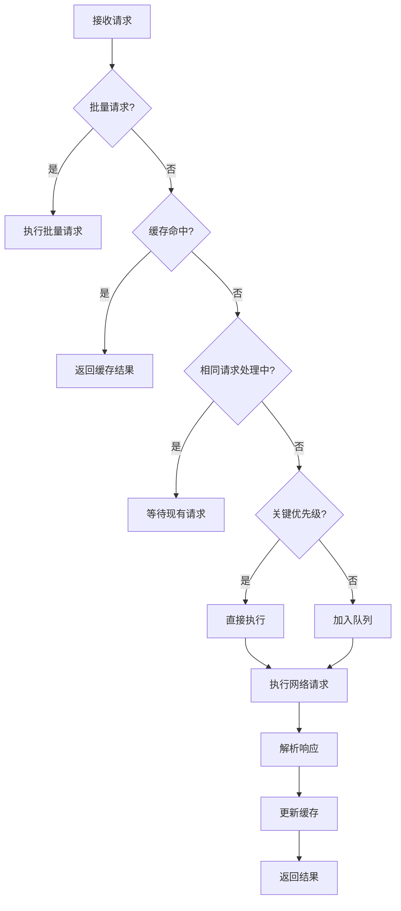

# 网络执行器 (NetworkExecutor) 文档

## 概述
`NetworkExecutor` 是网络框架的核心执行引擎，提供统一的网络请求入口，支持高效的并发控制、请求管理、缓存机制、队列调度和批量处理等功能。

## 文件位置
```
lib/src/requests/network_executor.dart
```

## 核心特性

### 1. 单例模式
- 全局唯一的网络执行器实例
- 统一的配置和状态管理
- 资源复用和性能优化

### 2. 并发控制
- 智能的请求去重机制
- 细粒度的并发锁控制
- 高效的异步请求处理

### 3. 队列管理
- 集成 `RequestQueueManager`
- 基于优先级的请求调度
- 支持请求排队和批量处理

### 4. 缓存机制
- 内置请求缓存系统
- 自动缓存管理和过期处理
- 可配置的缓存策略

### 5. 生命周期跟踪
- 完整的请求生命周期监控
- 性能指标收集和分析
- 详细的执行时间统计

## 主要组件

### RequestLifecycleTracker 请求生命周期跟踪器
```dart
class RequestLifecycleTracker {
  final String requestId;
  DateTime? startTime;
  DateTime? responseReceivedTime;
  DateTime? parseCompletedTime;
  DateTime? completedTime;
  
  String get summary; // 生成执行摘要
}
```

### 并发控制组件
```dart
class NetworkExecutor {
  // 并发安全锁
  final Lock _pendingRequestsLock = Lock();
  final Lock _cacheLock = Lock();
  final Lock _batchLock = Lock();
  
  // 请求状态管理
  final Map<String, Completer<NetworkResponse<dynamic>>> _pendingRequests = {};
  final Set<String> _batchRequestIds = {};
}
```

### 缓存管理组件
```dart
class NetworkExecutor {
  // 缓存存储
  final Map<String, dynamic> _cache = {};
  final Map<String, Timer> _cacheTimers = {};
  
  // 缓存操作方法
  Future<NetworkResponse<T>?> _getCachedResponse<T>(BaseNetworkRequest<T> request);
  void _cacheResponse<T>(BaseNetworkRequest<T> request, NetworkResponse<T> response);
}
```

## 核心方法

### 1. execute() - 执行网络请求
```dart
Future<NetworkResponse<T>> execute<T>(BaseNetworkRequest<T> request) async
```

**功能**：
- 统一的请求执行入口
- 自动缓存检查和管理
- 请求去重和并发控制
- 基于优先级的调度策略

**执行流程**：
1. 检查是否为批量请求
2. 检查缓存是否命中
3. 检查是否有相同请求正在处理
4. 根据优先级选择执行策略
5. 执行请求并返回结果

### 2. executeBatch() - 批量请求执行
```dart
Future<List<NetworkResponse>> executeBatch(List<BaseNetworkRequest> requests) async
```

**功能**：
- 并行执行多个请求
- 统一的结果收集
- 批量错误处理

### 3. executeConcurrent() - 并发限制执行
```dart
Future<List<NetworkResponse>> executeConcurrent(
  List<BaseNetworkRequest> requests, {
  int maxConcurrency = 3,
}) async
```

**功能**：
- 控制最大并发数量
- 分批处理大量请求
- 避免资源过度消耗

### 4. _executeRequest() - 具体请求执行
```dart
Future<NetworkResponse<T>> _executeRequest<T>(
  BaseNetworkRequest<T> request, {
  bool isBatch = false,
}) async
```

**功能**：
- 实际的网络请求执行
- 生命周期跟踪和监控
- 响应解析和错误处理
- 缓存更新和清理

### 5. _enqueueRequest() - 队列请求处理
```dart
Future<NetworkResponse<T>> _enqueueRequest<T>(BaseNetworkRequest<T> request) async
```

**功能**：
- 将请求加入队列管理器
- 优先级转换和调度
- 队列状态监控

## 请求处理流程

### 标准请求流程


### 生命周期跟踪
```dart
// 创建跟踪器
final tracker = RequestLifecycleTracker('${request.runtimeType}_$requestKey');

// 记录各个阶段
request.onRequestStart();           // 请求开始
tracker.onResponseReceived();       // 响应接收
tracker.onParseCompleted();         // 解析完成
tracker.onCompleted();              // 请求完成

// 生成执行摘要
NetworkLogger.executor.fine('请求完成: ${tracker.summary}');
```

## 缓存机制

### 缓存检查
```dart
if (request.enableCache) {
  final cachedResponse = await _getCachedResponse<T>(request);
  if (cachedResponse != null) {
    request.onRequestComplete(cachedResponse);
    return cachedResponse;
  }
}
```

### 缓存存储
```dart
if (request.enableCache) {
  _cacheResponse(request, networkResponse);
}
```

### 缓存过期管理
```dart
void _cacheResponse<T>(BaseNetworkRequest<T> request, NetworkResponse<T> response) {
  final cacheKey = _getRequestKey(request);
  _cache[cacheKey] = response;
  
  // 设置过期定时器
  _cacheTimers[cacheKey]?.cancel();
  _cacheTimers[cacheKey] = Timer(request.cacheExpiration, () {
    _cache.remove(cacheKey);
    _cacheTimers.remove(cacheKey);
  });
}
```

## 并发控制

### 请求去重
```dart
// 检查是否有相同请求正在处理中
final requestKey = _getRequestKey(request);
final existingCompleter = await _pendingRequestsLock.synchronized(() {
  return _pendingRequests[requestKey];
});

if (existingCompleter != null) {
  // 等待现有请求完成
  return await existingCompleter.future;
}
```

### 原子操作
```dart
// 原子操作：添加到待处理请求映射
await _pendingRequestsLock.synchronized(() {
  _pendingRequests[requestKey] = completer;
});
```

### 资源清理
```dart
finally {
  // 确保在所有情况下都清理资源
  await _pendingRequestsLock.synchronized(() {
    _pendingRequests.remove(requestKey);
  });
}
```

## 文件下载支持

### 下载请求处理
```dart
// 检查是否为下载请求
if (request is DownloadRequest) {
  final result = await _executeDownloadRequest<T>(request as DownloadRequest<T>);
  return result;
}
```

### 下载功能特性
- 自动创建保存目录
- 文件存在性检查
- 下载进度回调
- 文件验证和错误处理

### 下载示例
```dart
Future<NetworkResponse<T>> _executeDownloadRequest<T>(DownloadRequest<T> request) async {
  // 检查保存路径
  final saveFile = File(request.savePath);
  final saveDir = saveFile.parent;
  if (!await saveDir.exists()) {
    await saveDir.create(recursive: true);
  }
  
  // 执行下载
  final response = await _dio.download(
    options.path,
    request.savePath,
    onReceiveProgress: (received, total) {
      if (request.onProgress != null && total != -1) {
        request.onProgress!(received, total);
      }
    },
  );
}
```

## 错误处理

### 统一异常处理
```dart
catch (e) {
  // 使用统一异常处理系统
  final networkException = UnifiedExceptionHandler.instance.createNetworkException(error);
  
  // 尝试使用请求的自定义错误处理
  dynamic customException = request.handleError(error);
  final finalException = customException ?? networkException;
  
  request.onRequestError(finalException);
  throw finalException;
}
```

### 超时处理
```dart
// 检查是否已经收到了响应但处理超时
if (e is TimeoutException || e is DioException && e.type == DioExceptionType.receiveTimeout) {
  final response = await _checkResponseStatus<T>(request);
  if (response != null) {
    return response;
  }
}
```

## 使用示例

### 基本请求执行
```dart
// 创建请求
final request = GetRequest<UserProfile>(
  path: '/api/user/profile',
  priority: RequestPriority.high,
  enableCache: true,
  cacheExpiration: Duration(minutes: 5),
);

// 执行请求
final response = await NetworkExecutor.instance.execute(request);
if (response.isSuccess) {
  final userProfile = response.data;
  // 处理用户数据
}
```

### 批量请求执行
```dart
// 创建多个请求
final requests = [
  GetRequest<List<Post>>(path: '/api/posts'),
  GetRequest<UserProfile>(path: '/api/user/profile'),
  GetRequest<List<Notification>>(path: '/api/notifications'),
];

// 批量执行
final responses = await NetworkExecutor.instance.executeBatch(requests);
for (final response in responses) {
  if (response.isSuccess) {
    // 处理响应数据
  }
}
```

### 并发限制执行
```dart
// 大量请求的并发控制
final requests = List.generate(100, (index) => 
  GetRequest<Post>(path: '/api/posts/$index')
);

// 限制最大并发数为5
final responses = await NetworkExecutor.instance.executeConcurrent(
  requests,
  maxConcurrency: 5,
);
```

### 文件下载
```dart
// 创建下载请求
final downloadRequest = DownloadRequest<DownloadResult>(
  path: '/api/files/document.pdf',
  savePath: '/path/to/save/document.pdf',
  overwriteExisting: true,
  onProgress: (received, total) {
    final progress = (received / total * 100).toStringAsFixed(1);
    print('下载进度: $progress%');
  },
  onDownloadComplete: (filePath) {
    print('文件下载完成: $filePath');
  },
  onDownloadError: (error) {
    print('下载失败: $error');
  },
);

// 执行下载
final response = await NetworkExecutor.instance.execute(downloadRequest);
```

### 自定义拦截器
```dart
// 添加全局拦截器
NetworkExecutor.instance.addInterceptor(CustomInterceptor());

// 请求级别的自定义拦截器
final request = PostRequest<ApiResponse>(
  path: '/api/data',
  data: requestData,
  customInterceptors: [
    AuthInterceptor(),
    LoggingInterceptor(),
  ],
);
```

## 性能优化

### 1. 请求去重
- 避免重复的网络请求
- 共享相同请求的结果
- 减少网络资源消耗

### 2. 缓存机制
- 智能的缓存策略
- 自动过期管理
- 内存使用优化

### 3. 并发控制
- 合理的并发限制
- 避免资源竞争
- 提高整体性能

### 4. 队列调度
- 基于优先级的调度
- 批量处理优化
- 资源均衡分配

## 配置管理

### Dio配置
```dart
void _initializeDio() {
  final config = NetworkConfig.instance;
  
  _dio = Dio(BaseOptions(
    baseUrl: config.baseUrl,
    connectTimeout: Duration(milliseconds: config.connectTimeout),
    receiveTimeout: Duration(milliseconds: config.receiveTimeout),
    sendTimeout: Duration(milliseconds: config.sendTimeout),
    headers: config.defaultHeaders,
  ));
  
  _setupInterceptors();
}
```

### 拦截器设置
```dart
void _setupInterceptors() {
  final config = NetworkConfig.instance;
  
  if (config.enableLogging) {
    _dio.interceptors.add(LogInterceptor(
      requestBody: true,
      responseBody: true,
      error: true,
    ));
  }
}
```

### 动态重配置
```dart
// 重新配置Dio
NetworkExecutor.instance.reconfigure();

// 添加/移除拦截器
NetworkExecutor.instance.addInterceptor(newInterceptor);
NetworkExecutor.instance.removeInterceptor(oldInterceptor);
```

## 设计模式

### 1. 单例模式
确保全局唯一的执行器实例。

### 2. 策略模式
不同的执行策略（直接执行、队列执行）。

### 3. 装饰器模式
拦截器链的实现。

### 4. 观察者模式
请求生命周期的监听。

### 5. 工厂模式
异常对象的创建。

## 注意事项

1. **并发安全**: 使用适当的锁机制确保线程安全
2. **资源管理**: 及时清理请求状态和缓存数据
3. **错误处理**: 完善的异常处理和恢复机制
4. **性能监控**: 监控请求性能和资源使用情况
5. **缓存策略**: 合理设置缓存过期时间和大小限制
6. **队列管理**: 避免队列积压和内存泄漏
7. **生命周期**: 正确处理请求的各个生命周期阶段